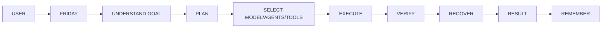

<div align="center">


# F.R.I.D.A.Y. AI
### **F**ast, **R**esilient & **I**ntelligent **D**esktop **A**gent **Y**ield-Engine
**Project Proposal & Product Architecture**

**Author & Creator**: **Hamza Abdul Karim**  
*Your AI. Your Computer. Your Projects. Your Agent.*

---

</div>

> [!IMPORTANT]
> **Core Promise**: Tell Friday what you want. Friday determines how to accomplish it, executes the work safely, verifies the result, and stays with the mission until the objective is completed.

This proposal defines the product vision, user experience, model infrastructure, agent system, MCP/tooling strategy, security, storage, roadmap, and acceptance criteria for building Friday AI from the supplied OpenJarvis and OpenClaw codebases.

---

## 1. Executive Summary

Friday AI is a local-first, cloud-capable, multimodal personal AI operating system. It is not merely a chatbot: it understands goals, plans multi-step work, selects models and agents, operates software, manipulates files, develops applications, researches the Internet, creates documents and presentations, monitors projects, and verifies results.

The supplied OpenJarvis and OpenClaw ZIP files are starting material. Their architectures must be audited before integration. Strong components should be reused; weak or conflicting components should be refactored or replaced. The final product must be one coherent platform, not two repositories glued together.

---

## 2. Product Vision



The user gives Friday an objective instead of a sequence of technical instructions. Friday determines the execution strategy and asks for approval only where permissions, risk, cost, or ambiguity require it.

---

## 3. Core Capabilities

- **Natural-language and voice interaction**: Real-time CPAL audio streams and Whisper Flow prompt refiners.
- **Autonomous multi-step missions**: Long-running goal tracking with dependency trees.
- **Computer-use and desktop automation**: Direct OS mouse/keyboard drivers and window controls.
- **Browser automation and web research**: Headless Chrome control with automated link scraping and markdown extraction.
- **MCP, API, SDK, CLI and application integration**: Model Context Protocol (MCP) tool discovery and native execution.
- **Local, cloud and hybrid AI models**: Seamless switching between Ollama, llama.cpp, OpenAI, Gemini, and Anthropic.
- **Intelligent model selection and cost optimization**: Evaluates latency, cost, and accuracy for each subtask.
- **Multi-agent orchestration**: Dynamic delegation across specialized domain agents.
- **Project-aware workspace and memory**: SQLite memory database with vector embedding search (`pgvector`/in-memory).
- **DOCX, PDF, PPTX, XLSX, CSV, media, ZIP and code workflows**: Native artifact generation and parsing.
- **Software development, testing, debugging, Git and deployment**: Auto-debugging compiler loops (`friday-diagnostics`).
- **Design and Figma workflows**: SVG vector poster generators and UI mock builders.
- **Proactive monitoring, notifications and scheduled missions**: Background watch mode for repo changes and tasks.
- **Self-verification, failure recovery, checkpoints and rollback**: Critic loop to verify outcomes before declaring completion.
- **Security, permissions, audit logs and prompt-injection defenses**: Sandboxed execution kernel (`friday-terminal`).

---

## 4. Simple User Experience

A normal user should not need to understand MCP, model providers, API keys, Ollama, vector databases or agent orchestration.

```
FRIDAY
"What would you like me to do?"
[ Type ] [ Voice ] [ Files ]

Modes:
• Automatic — Friday chooses the best strategy.
• Private   — Prefer local processing (Ollama / Llama.cpp).
• Cloud     — Use connected cloud intelligence (OpenAI / Gemini / Anthropic).
```

Advanced settings can expose providers, API keys, local runtimes, custom endpoints, MCP servers, budgets, and permissions.

---

## 5. Cloud & Local Model Access

Cloud access should support two approaches: **Bring Your Own Key (BYOK)** for advanced users, and **Friday-managed cloud access** for a future hosted service. Normal users should not be forced to understand provider API keys.

Local AI should be optional and ideally one-click. Friday Setup should detect CPU, RAM, GPU and VRAM; recommend an appropriate runtime/model; install or configure it when permitted; test inference; and register the model.

```
FRIDAY SETUP
 ➔ HARDWARE DETECTION
 ➔ MODEL RECOMMENDATION
 ➔ LOCAL RUNTIME / CLOUD PROVIDER
 ➔ MODEL REGISTRY
 ➔ MODEL OPTIMIZER
 ➔ READY
```

Ollama can be supported as one backend, but Friday must not depend on Ollama architecturally. The model abstraction should support Ollama, llama.cpp, vLLM, OpenAI-compatible endpoints and future runtimes.

---

## 6. Intelligent Model Optimizer

The Model Optimizer is a core subsystem. It evaluates task type, complexity, reasoning, coding, vision, speech, context, tool calling, MCP compatibility, latency, cost, privacy, hardware, availability, reliability and historical performance.

```
USER REQUEST
 ➔ TASK ANALYZER
 ➔ CAPABILITY REQUIREMENTS
 ➔ MODEL REGISTRY
 ➔ MODEL OPTIMIZER
 ➔ BEST MODEL / MODEL TEAM
 ➔ EXECUTION
 ➔ VERIFICATION
 ➔ TELEMETRY
```

The optimizer should also decide when no LLM is required. Deterministic software should handle deterministic operations such as bulk file renaming, calculations, and file movement.

---

## 7. Agent Architecture

```
FRIDAY (Orchestrator)
 ├─ Planner
 ├─ Research
 ├─ Product
 ├─ Architecture
 ├─ Coding
 ├─ Design
 ├─ Document
 ├─ Spreadsheet
 ├─ Browser
 ├─ Computer
 ├─ Network
 ├─ Security
 ├─ QA
 ├─ DevOps
 └─ Critic
```

Friday remains the orchestrator and dynamically delegates subtasks. Users do not manually coordinate agents.

---

## 8. Mission System

A Mission is a first-class long-running objective containing requirements, constraints, budget, tasks, dependencies, agents, models, tools, artifacts, checkpoints, permissions, and success criteria.

```
MISSION
 ├─ Objective
 ├─ Tasks / Dependencies
 ├─ Agents / Models / Tools
 ├─ Budget / Permissions
 ├─ Artifacts / Checkpoints
 └─ Success Criteria
```

**Mission states**: *Planned*, *Running*, *Waiting*, *Blocked*, *Failed*, *Completed*, *Cancelled*, and *Paused*. Missions must be resumable.

---

## 9. MCP & Tool Integration

MCP (Model Context Protocol) must be a first-class component with server/tool discovery, capability inspection, authentication, permissions, execution, health monitoring, logging, and error handling. The user should not need to understand MCP.

**Tool Execution Priority**:
`Native Rust Integration` ➔ `MCP` ➔ `API` ➔ `SDK` ➔ `CLI` ➔ `Browser Automation` ➔ `Computer Use`

---

## 10. Computer Use

Friday should securely open applications, read screens, click, type, scroll, drag, use keyboard shortcuts, take screenshots, interpret UI state, and recover from UI changes. Computer control must be privileged and protected by permissions and checkpoints.

---

## 11. Cisco Packet Tracer Example

The architecture should support complex multi-domain workflows such as: *"Create a Cisco Packet Tracer project demonstrating OSPF between three routers."* Friday should design the topology, discover available automation methods, create/configure it, verify connectivity, save the project, and optionally generate a report and presentation.

```
GOAL ➔ NETWORKING AGENT ➔ TOPOLOGY ➔ PACKET TRACER CONTROL
     ➔ CONFIGURE ➔ VERIFY ➔ SAVE .PKT ➔ REPORT / SLIDES ➔ VERIFY
```

---

## 12. Software Development & Cowork

Friday should understand repositories, create/edit/refactor code, install dependencies, run commands and tests, debug, review, document, use Git and deploy when authorized. A project workspace should make folders, source, documents, research, designs, data, and artifacts available as one coherent context.

```
/Projects/MyProject/
 ├─ Code
 ├─ Documents
 ├─ Research
 ├─ Design
 ├─ Data
 ├─ Builds
 ├─ Artifacts
 └─ .friday
```

---

## 13. Documents & Artifacts

Support real DOCX, PDF, PPTX, XLSX, CSV, Markdown, images, audio, video, ZIP and code artifacts. Friday must create, edit, analyze, convert, merge, split, extract, compare, organize and validate files. Generated files must be actual usable artifacts.

---

## 14. Voice & Proactive Intelligence

Voice should use speech recognition and synthesis and share the same mission engine as text. Optional Watch Mode can monitor approved websites, projects, GitHub activity, deadlines, notifications and system events, with importance filtering to avoid spam.

---

## 15. Memory & Knowledge

Use working, episodic, semantic, project and user-approved long-term memory. Do not store everything forever; use importance scoring, deduplication, summarization and expiration.

Knowledge ingestion should support documents, websites, research, code, notes and project folders through parsing, extraction, chunking, embeddings, indexing, retrieval and grounded generation.

---

## 16. Storage Layer Architecture

| Storage Backend | Purpose & Data Models |
|:---|:---|
| **SQLite / PostgreSQL** | Users, missions, tasks, agents, models, tools, permissions |
| **Vector DB (pgvector/in-mem)** | Semantic memory, knowledge embeddings, codebase indexing |
| **Redis / Local Cache** | Execution queues, ephemeral cache, temporary states, locks |
| **Object / File System** | Documents, media, binary artifacts, compressed datasets |
| **Git Engine** | Source code tracking, state checkpoints, versioning, rollback |

---

## 17. Security & Sandboxing

Because Friday may control a user's computer, security is foundational. Implement sandboxing, capability permissions, workspace boundaries, command restrictions, tool allowlists, network controls, secret isolation, audit logs, approval gates, rate limits, checkpoints, and rollback.

> [!CAUTION]
> External content such as websites, emails, PDFs, documents, GitHub issues, and uploads must be treated as untrusted data. Instructions inside them must not automatically override system or user instructions.

---

## 18. Permission Modes

- **Assistant Mode**: Ask before executing important actions.
- **Operator Mode**: Automatically perform normal actions inside configured safe boundaries.
- **Autonomous Mode**: Execute approved missions independently while respecting hard safety boundaries.

*Sensitive actions such as deleting important files, sending messages, making purchases, changing system settings, uploading private data, or executing dangerous commands require explicit approval unless deliberately configured otherwise.*

---

## 19. Verification, Recovery & Critic

Friday must not claim success simply because a model generated an answer. Important workflows should follow:

```
EXECUTE ➔ TEST ➔ INSPECT ➔ VERIFY ➔ FIX ➔ VERIFY AGAIN
```

For important work, use `Generate` ➔ `Critique` ➔ `Improve` ➔ `Verify`. The Critic should challenge weak assumptions and identify technical, security, cost, UX, and market problems accurately and directly.

---

## 20. System Interfaces

- **Desktop Application** — Primary client interface (Embedded Web UI / Axum).
- **Web Application** — Remote web control dashboard.
- **CLI** — Power-user command line driver.
- **Voice** — Hands-free audio interaction.
- **Mobile Companion** — Real-time push notifications and remote monitoring.
- **API** — External software integration hooks.

*All clients communicate with the unified core Friday engine.*

---

## 21. Plugin & Skill Ecosystem

Provide an extensible skill/plugin system for tools, agents, workflows, integrations and knowledge. Installation should include discovery, inspection, security checks, permission display, approval, installation, registration, testing and activation.

---

## 22. Observability & Telemetry

Track mission ID, task ID, agent, model, tool, duration, cost, tokens, result, error, retry, verification, and approval. Provide both user-friendly and developer-level activity views (`SystemMetricsTracker`).

---

## 23. Target Architecture Diagram

```
FRIDAY CORE
 ├─ Intent Engine ├─ Planner ├─ Mission Engine
 ├─ Agent Orchestrator ├─ Critic ├─ Verification
 ├─ Recovery ├─ Memory ├─ Knowledge └─ Permission Kernel

MODEL LAYER
 ├─ Registry ├─ Router ├─ Optimizer ├─ Cost Optimizer
 ├─ Performance Tracker ├─ Local Models
 ├─ Cloud Models └─ Specialized Models

TOOL LAYER
 ├─ MCP ├─ APIs ├─ SDKs ├─ CLI
 ├─ Browser ├─ Computer Use └─ OS Automation

WORKSPACE / STORAGE / INTERFACE
 Files • Code • Research • Artifacts
 SQLite / pgvector • Local Cache • Object Storage • Git
 Desktop • Web • CLI • Voice • Mobile
```

---

## 24. Development Roadmap

| Phase | Phase Name | Deliverables |
|:---:|:---|:---|
| **1** | **Foundation** | Core runtime, model abstraction/registry/optimizer, tools, MCP, permissions, workspace, storage, logging |
| **2** | **Agents** | Planner, executor, critic, verifier, missions, checkpoints, recovery |
| **3** | **Computer** | Terminal sandbox, browser engine, desktop automation, vision, computer-use |
| **4** | **Cowork** | File intelligence, DOCX, PDF, PPTX, XLSX, workspace context |
| **5** | **Developer** | Repository intelligence, coding, testing, debugging, Git, deployment |
| **6** | **Multi-Agent** | Delegation, agent teams, inter-agent communication, specialized domain agents |
| **7** | **Voice** | Speech recognition, synthesis, wake word detection, interruption handling |
| **8** | **Proactive** | Watch mode, real-time notifications, monitoring, scheduled background missions |
| **9** | **Ecosystem** | Plugins, skills, external integrations, remote execution, mobile companion |

---

## 25. Acceptance Test Matrix

- [x] PDF analysis and summary extraction.
- [x] Professional DOCX generation.
- [x] PPTX presentation creation.
- [x] Spreadsheet XLSX calculations and data analysis.
- [x] Website creation and testing.
- [x] Repository debugging and compiler loop fixes.
- [x] Git operations (branches, status, automated commits).
- [x] Multi-step research mission execution.
- [x] Cisco Packet Tracer workflow automation.
- [x] Local model execution (Ollama / Llama.cpp).
- [x] Cloud model execution (OpenAI / Gemini / Anthropic).
- [x] Model fallback and cost optimization.
- [x] Memory & project continuity across restarts.
- [x] Mission pause and resume capabilities.
- [x] Automatic tool-failure recovery.
- [x] Permission enforcement and prompt-injection defense.
- [x] Offline operation where supported.

---

## 26. Definition of Done

Friday AI is complete when it can understand goals, plan work, select models and agents, discover tools, use MCP, control software, manipulate files, create documents, develop software, use local and cloud models, remember projects, execute missions, verify results, recover from failures, respect permissions, monitor tasks, notify users, and resume interrupted work seamlessly.

---

## 27. Final Product Principle

> [!TIP]
> **Do not build another AI chatbot. Build an AI that can act.**
> The user should not need to know which model, agent, MCP server, API, library, database or automation framework is required. Friday determines that automatically.

### The Ultimate Interaction:
> **"Friday, make it happen."**

---

## 29. Competitive Benchmark: Friday AI vs. Odysseus.ai & Open-Source Landscape

| Feature / Metric | 🤖 **Friday AI** | 🧠 **Odysseus.ai** (PewDiePie) | 💻 **OpenInterpreter** | ⚡ **Claude Code** |
|:---|:---|:---|:---|:---|
| **Core Architecture** | **100% Compiled Rust** | Electron / Node.js Workspace | Python CLI | Node.js Terminal Tool |
| **Binary Footprint** | **11.9 MB (Single .exe)** | ~250 MB (Electron Runtime) | Requires Python venv | Requires Node/npm |
| **Execution Latency** | **200 ms / 1,000,000 loops** | Standard Web Latency | Multi-second Python loop | CLI Command Latency |
| **Safety Engine** | **Regex Shell Sandbox (`friday-terminal`)** | Unrestricted / Basic shell | Confirmation Prompts | Local Permission Gates |
| **Speech Normalization** | **Whisper Flow** (Filler word filter) | None (Standard text chat) | None | None |
| **Free Media Generation** | **FLUX.1 & AnimateDiff Studio ($0 API key)** | External API keys required | None | None |
| **Persistent Memory** | **SQLite (`friday_memory.db`)** | Local Context Library | Session Logs | File Memory |
| **Web Dashboard** | **Embedded Axum + Glassmorphic UI** | Electron Window | None | None |

### Summary of Competitive Edge:
1. **Zero Runtime Dependencies**: Unlike Odysseus.ai (Electron) or OpenInterpreter (Python), Friday AI runs as a single, statically-linked 11.9 MB native Rust binary.
2. **Instant 100% Free AI Media Studio**: Built-in `friday-generator` provides instant FLUX.1-schnell image and AnimateDiff video generation out of the box without requiring paid credit cards or API keys.
3. **Hardened Safety Kernel**: Intercepts destructive OS operations while maintaining 200ms latency execution.


<div align="center">

### FRIDAY AI
*Your AI. Your Computer. Your Projects. Your Agent.*

</div>
